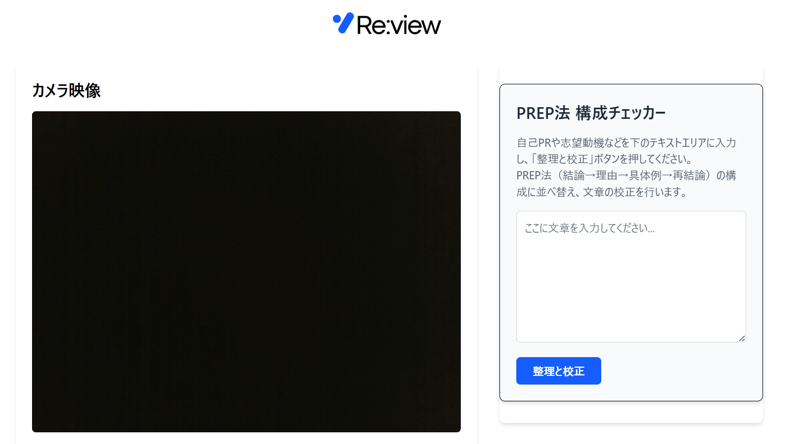

# Re:view - あなたの話し方を「見える化」する面接練習ツール

## 製品概要
### 背景(製品開発のきっかけ、課題等）
「面接練習をしたいけれど、自分の姿や声を外部のサーバーに保存されるのは不安…」「模擬面接をお願いできる相手が周りにいない…」
**Re:view**は、そんな就職活動中の学生が抱える悩みに応えるために開発されました。高価なAIサービスに頼ることなく、誰でも手軽に、そして安心して客観的なフィードバックを得られる環境を提供します。

### 製品説明（具体的な製品の説明）
**Re:view**は、あなたのデバイス（PC）のブラウザ内だけで動作が完結する、プライバシーを重視した面接練習Webアプリケーションです。Webカメラに向かって話すだけで、あなたの「話す速さ」「口癖」「間の取り方」などを独自のアルゴリズムが分析・可視化。具体的な改善アドバイスを提示し、あなたの自己表現力を高めるサポートをします。

### 特長
#### 1. プライバシー第一の安心設計
録画・録音されたデータは外部のサーバーに一切送信されません。すべての分析処理はあなたのブラウザ内で完結するため、個人情報やプライベートな練習風景が外部に漏れる心配なく、安心してご利用いただけます。

#### 2. AI不要の独自の分析アルゴリズム
複雑なAIモデルではなく、ルールに基づいた[独自の分析アルゴリズム](https://github.com/jphacks/sd_2503/commit/b6578859480fdd77dfc44d0dd22043eb76efd925)を搭載。マイクから入力された音声データをリアルタイムに解析し、「話す速さ(文字/分)」「口癖の出現回数」などを定量的に評価します。

#### 3. 具体的な改善アドバイス
分析結果をもとに、あなたの話し方の癖を改善するための具体的なフィードバックを提示します。例えば、「少し早口です。もう少しゆっくり話しましょう」といったシンプルな指摘で、次の練習の目標を明確にします。

### 解決出来ること
*   プライバシーを気にすることなく、客観的なフィードバック付きの面接練習ができる。
*   自分の話し方の癖（早口、口癖、間の取り方など）を定量的に把握できる。
*   第三者の手を借りずに、一人で手軽に面接スキルを向上させられる。
*   Yahoo! JAPANのAPIを利用して、敬語や日本語表現の誤りをチェックできる。
*   動画の録画を確認できる。

### 今後の展望
*   分析指標の追加（視線の動きなど）
*   ユーザーが改善したい癖を登録し、集中的に練習できるモード
*   オフラインでも完全動作するPWA（プログレッシブウェブアプリ）化

### 注力したこと（こだわり等）
*   **ブラウザ完結へのこだわり**: ユーザーのプライバシー不安を解消するため、録画・分析の全プロセスをクライアントサイドで完結させるアーキテクチャにこだわりました。サーバーを介さないことで、レスポンスの速さも向上させています。
*   **シンプルで分かりやすいUI/UX**: 誰もが直感的に使えることを目指し、複雑な設定をなくし「録画ボタンを押すだけ」というシンプルな操作性を追求しました。

## 開発技術
### 活用した技術
#### API・データ
*   **Web Speech API**: ブラウザ標準のAPIで、リアルタイムの音声認識（文字起こし）を実現。
*   **Web Audio API**: マイクからの音声データをリアルタイムで解析し、音量や沈黙区間を検出。
*   **Yahoo! JAPAN 校正支援API**: （オプション機能）ユーザーが文字起こし結果の文章をサーバーに送信することを選択した場合に限り、文法や表現をチェックし、修正案を提示します。

#### フレームワーク・ライブラリ・モジュール
*   **Svelte5 / SvelteKit**: フロントエンドからサーバーサイド（APIルート）まで一貫して採用。
*   **Tailwind CSS**: 迅速なUIデザインを実装。
*   **Vite**: 高速な開発サーバーとビルドプロセスを提供。

#### デバイス
*   Webカメラ
*   マイク

### 独自技術
#### ハッカソンで開発した独自機能・技術
*   **ブラウザ完結型の音声分析エンジン**: Web Audio APIから得られる音声データをもとに、話している時間、文字数、口癖の出現頻度、沈黙の回数などを計測・分析するロジックをJavaScriptで開発しました。これにより、サーバー通信なしでの客観的な話し方の評価を実現しています。
    *   関連ファイル: `src/lib/page-logic.js`
